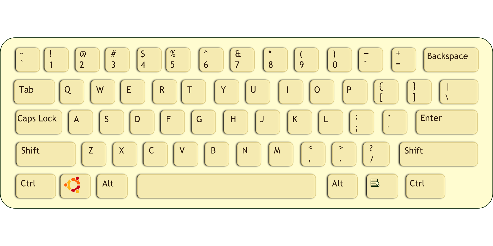

# 003 사칙연산

3번째 시간입니다!

먼저 코드부터 보죠.

처음에 더하기, 빼기는 우리가 일반적으로 사용하는 덧셈과 뺄셈과 같습니다. 하지만 그 아래부터는 뭔 소리죠?

이걸 설명하기 위해 우리는 키보드를 한번 슬쩍 보겠습니다.

.... 보기 귀찮으시다고요? 그런 여러분을 위해 준비했습니다.

여기 중에 우리가 사용하는 곱셈 기호($\times$)나 나눗셈 기호($\div$)를 눈을 씻고 봐도 키보드에서는 찾을 수 없습니다. 그래서 컴퓨터의 대부분의 언어에서 정의한 곱셈 기호와 나눗셈 기호는 각각 (*)과 (/)입니다. 손가락 두 번만 움직이면 되서 편하죠.

이외에도 이상한 게 2개가 있습니다. (//)와 (%) 기호인데요, (//)는 python 3이라는 버전에서 새로 등장한 기호입니다. (//)는 소수점 아래를 자르고, 정수부분만 출력을 합니다. (%)는 나눗셈의 나머지 부분을 출력합니다. 이제 여러분은 지금까지 해왔던 사칙연산을 컴퓨터에 한 줄만 쓰면 모든게 해결됩니다.
